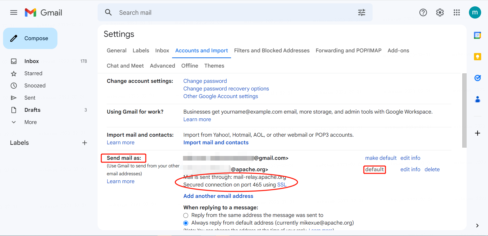

# How to Use Email

## Apache email usage based on Gmail

> When you become a committer, you will have an apache email. This tutorial uses apache email based on Gmail.

#### 1. Login to Gmail

* [Gmail's official website](https://gmail.google.com) is here

#### 2. Set up your Apache email

#### 3. Click on settings


#### 4. Find your Apache email[#](https://shenyu.apache.org/community/use-apache-email/#4-find-your-apache-email)

You should have an email from `root@apache.org` like this in your mailbox:

- Titled `Welcome to the Apache Software Foundation`

- The content is as follows

  ```text
  Dear YYYY,
  Good news! We have created your Apache Software Foundation (ASF) committer account, and it is now ready for you.
  Your ApacheID is: xxxx
  ......
  ```

- Your Apache email is `xxxx@apache.org`

#### 5. Add Apache email

- Login to [id.apache.org](https://id.apache.org/), config the forwarding email


- add the apache email to the Gmail settings



> Before the config is set, the Gmail mailbox is used to send by default, and the apache mailbox can be added as the default sending email mailbox. This process requires related configuration and email confirmation verification.

## Apache email usage based on 163/126-email

#### 1. Login to 163/126-email

* [163 email website](https://mail.163.com) is here
* [126 email website](https://mail.126.com/) is here

#### 2. Set your Apache email forward address


after set this step, you can receive your apache email

#### 3. Settings for 126 email


1. choose settings
2. add email sender
3. write your apache email information and next step


4. choose next step


5. set apache email as default sender

#### 4. Send email


you can choose your email sender

## Appendix

- **QQ mailbox switch to plain text format**


- **Email configuration reply default subject keywords** Chinese `Reply: `There will be problems 

- **Modify general mailbox settings** 
