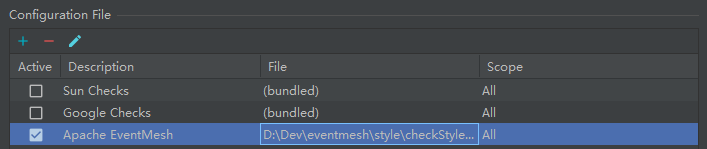
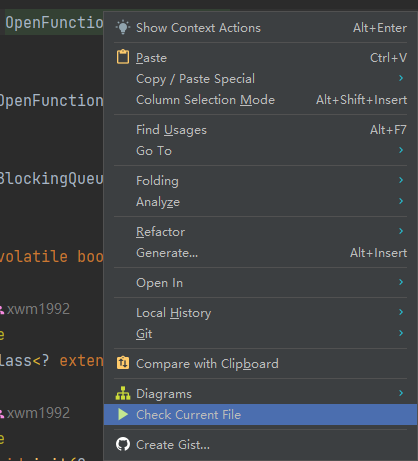
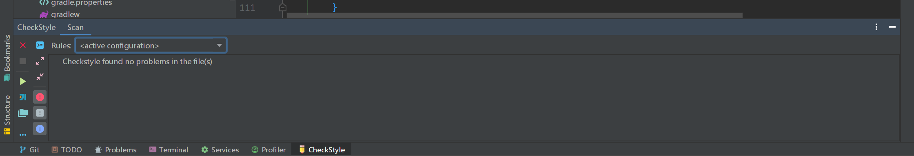
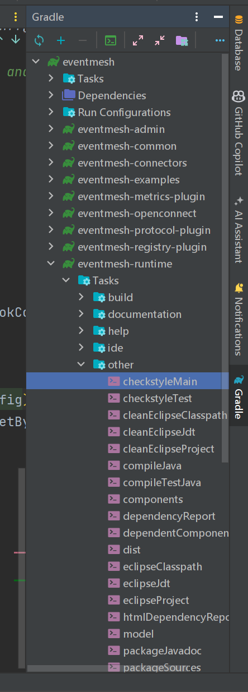

# How to Contribute

If you are a new contributor who wants to contribute to the eventmesh community, please read this document, which describes how to contribute to the community, and if you find any questions in the document, feel free to leave comments or suggestions.

## Preparation

### Development environment

- You should have the JDK installed in your development environment.

### Code Style

#### Import Code Style

File location: Import the [`eventmesh-code-style.xml`](https://github.com/apache/eventmesh/blob/master/style/eventmesh-code-style.xml) file located in the `eventmesh/style` directory of the source code into **`IntelliJ IDEA`**.

```
Settings -> Editor -> Code Style -> Import Scheme -> IntelliJ IDEA code style XML
```


#### Import CheckStyle

File location: Import the [`checkStyle.xml`](https://github.com/apache/incubator-eventmesh/blob/master/style/checkStyle.xml)file located in the `eventmesh/style` directory of the source code into **`IntelliJ IDEA`**.

Please install the CheckStyle-IDEA plugin. For IDEA, you need to import the CheckStyle code style file in the following two settings:
```shell
Settings -> Editor -> Code Style -> Java -> Scheme -> Import Scheme -> CheckStyle Configuration
```

```
Settings -> Tools -> Checkstyle -> Configuration File
```


#### Enable CheckStyle

You can set EventMesh's code style file to `Active` (default option) in `Tools -> Checkstyle -> Configuration File`. Otherwise, before running CheckStyle checks, you will need to manually specify EventMesh's code style configuration.



#### Use CheckStyle Plugin

To check the code style of the current file, the simplest way is to right-click in the editor and execute `Check Current File`:



It will open a tab at the bottom where you can observe code style warnings output. If none appear, everything complies with the standards.



You can further run scans for the current module or the entire project on the left side of this tab.

(Note: When you submit a PR, the CI will only check the files that were changed in that PR).

#### Use CheckStyle Task

You can perform a code style scan for a specific module or the entire project in the right-side Gradle tab in IDEA:



You can also use `./gradlew check` in the terminal to check the code style of all files in the project.

### Workflow

Here are the workflow for contributors:

1. Fork to your own

2. Clone fork to local repository
```git
git clone git@github.com:yourgithub/incubator-eventmesh.git
```

3. Create a new branch and work on it
```git
git checkout -b fix_patch_xx
```

4. Keep your branch in sync
```git
git remote add upstream git@github.com:apache/incubator-eventmesh.git
git fetch upstream master:upstream_master
git rebase upstream_master
```

5. Commit your changes (make sure your commit message concise)

6. Push your commits to your forked repository

7. Create a pull request

## Explanation

The original warehouse: https://github.com/apache/incubator-eventmesh The apache warehouse of eventmesh is called the original warehouse in the text.

The Fork library: From https://github.com/apache/eventmesh fork to your own personal repository to become a fork library.

So fork the original EventMesh repository into your own repository.

## Development branch

**The current development branch of eventmesh is Master. Please submit PR to this branch.**

- We recommend that you create a new branch in your repository for development and submit the branch to the master branch of eventmesh.

## Contribution Categories

### Bug feedback or bug fixes

- Whether it's a bug feedback or a fix, an issue needs to be created first to describe the bug in detail, so that the community can easily find and view the problem and code through the issue record. bug feedback issues usually need to contain a complete description of the bug information and reproducible scenarios.

### Implementation of functions, refactoring

- If you plan to implement a new feature (or refactoring), be sure to communicate with the eventmesh core development team via an Issue or other means, and describe the new feature (or refactoring), mechanism and scenario in detail during the communication process.

### Documentation Improvement

- You can find the eventmesh documentation at [eventmesh-docs](https://eventmesh.apache.org/docs/introduction), and the documentation is supplemented or improved in a way that is also essential for eventmesh.

## Contribution method

There are two ways for new contributors to contribute to the eventmesh community:

- If you find a bug in the eventmesh code that you want to fix, or if you provide a new feature for the eventmesh, submit an issue in the eventmesh and submit a pr to the eventmesh.

- Other contributors in the eventmesh community have raised issues, the [`issue for first-time contributors`](https://github.com/apache/incubator-eventmesh/issues/888) sorted out by the community here are relatively simple PR, which can help you familiarize yourself with the process of making contributions to the eventmesh community.

## Submit issue guidelines

- If you don't know how to raise an issue on eventmesh, please read [about the issue](https://docs.github.com/cn/issues/tracking-your-work-with-issues/quickstart).

- In the eventmesh community, there are issue templates that can be used for reference, if the type matches please use the template, if the issue template does not meet your requirements, you can open an empty issue template, for the issue please bring its matching feature labels.

- For the name of the issue, please briefly describe your question or purpose in one sentence, and write in English for better global communication.

##  pull request (pr) submission guidelines

- If you don't know how to initiate a pr for eventmesh, please see [about pull request](https://docs.github.com/en/pull-requests/collaborating-with-pull-requests/proposing-changes-to-your-work-with-pull-requests/creating-a-pull-request).

- Whether it's a bug fix, or a new feature development (if this pr is a new feature development, then documentation updates about the new feature should be included in this pr), please submit a PR to the current development branch master.

- The pr submission should follow the template provided by eventmesh as well as the need to write the submission information, a brief description of what the pr you are submitting does is sufficient, please see the [template for details](https://github.com/apache/incubator-eventmesh/blob/master/.github/PULL_REQUEST_TEMPLATE.md).

- The pr you submit needs to be associated with the issue you are fixing, or the issue you are raising,so your PR title should start with [ISSUE #xx].

- If your change is about a typo or small optimize, you needn't create an Issue, just submit a PR and title with [MINOR].

**Note:**

- A single pull request should not be too large. If heavy changes are required, it's better to separate the changes to a few individual PRs.

- After creating a PR, one or more committers will help to review the pull request, after approve, this PR will be merged in to eventmesh repository, and the related Issue will be closed.

## review

### PR review

All code should be well reviewed by one or more committers. Some principles:

- Readability: Important code should be well-documented. Comply with our [code style](https://github.com/apache/incubator-eventmesh/blob/master/style/checkStyle.xml).

- Elegance: New functions, classes or components should be well-designed.

- Testability: Important code should be well-tested (high unit test coverage).

### License review

EventMesh follows [Apache License 2.0](http://www.apache.org/licenses/LICENSE-2.0.html) policy. All source files should
have the Apache License header added to the file header. EventMesh uses the [apache/skywalking-eyes](https://github.com/apache/skywalking-eyes) to check
the source file header.

### PR merge

After a PR is approved by at least one committer, it can be merged. Before the merge, the committer can make changes to the commits message, requiring the commits
message to be clear without duplication, and use Squash and Merge to make sure one PR should only contain one commits.
For large multi-person PR, use Merge to merge, and fix the commits by rebase before merging.

## Community

### Contact us

Mail: dev@eventmesh.apache.org
