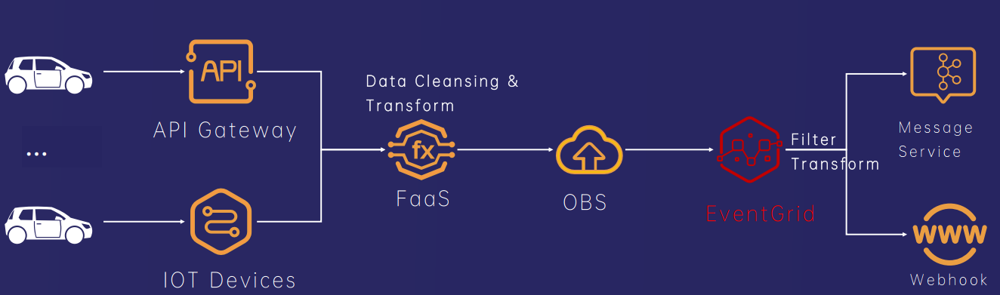

# Serverless Solution for Connected Vehicle Services

*   Application scenario name

&emsp;&emsp;**Serverless Solution for Connected Vehicle Services**
 

*   Application scenario description

&emsp;&emsp;In the connected vehicle scenario, the huge number of vehicles and the variety of models from different automakers generate massive amounts of data. A single vehicle can have hundreds of sensors continuously producing data, and during peak hours (such as morning and evening rush hours), the volume of connected vehicle data can surge dramatically. Additionally, the automotive industry lacks standardized software development kits for connected vehicles to reduce development costs and shorten time-to-market. This creates a broad demand for Serverless solutions tailored to connected vehicle services.

&emsp;&emsp;The Serverless solution for connected vehicle services can use `EventMesh` as an event bus and event center. The vast amounts of data from vehicle sensors, GPS devices, and cloud platforms can be ingested via API gateways or IoT devices. Once processed by the event-driven architecture, the solution provides real-time responses and scales smoothly to handle increased traffic during peak times(such as morning and evening rush hours).

*   Application scenario implementation proposal

&emsp;&emsp;The Serverless solution for connected vehicle services, powered by `EventMesh`, offers dynamic scaling and high flexibility in an event-driven architecture. It meets the demand for high concurrency and rapid elasticity.It can scale dynamically during traffic surges to handle highly concurrent data. `EventMesh` also provides flexible routing capabilities, allowing events to be routed to different systems and services based on customizable configuration rules.

&emsp;&emsp;The diagram above illustrates the Serverless solution for connected vehicle services. First, data can be cleaned, filtered using the filter and transformer capabilities of `EventMesh`,then data is processed via function computation.After processing, the data is stored in distributed object storage, and events are generated. `EventMesh` routes these events to the appropriate services based on predefined configuration rules. These services include peak-shaving and valley-filling consumption services, AI-based intelligent recommendation services, and multiple departmental business services. This architecture allows each service to respond only to relevant events without coupling to the data source directly.

&emsp;&emsp;In addition, this solution offers features such as automatic scaling, fault tolerance with retry mechanisms, and cross-regional support, ensuring reliable event delivery even under high-load conditions. With `EventMesh`, external Webhooks can also be integrated, allowing events to be pushed to other systems or third-party services, facilitating future service expansion.

*   Reference

&emsp;&emsp;["How Does Apache Eventmesh Solve The Saas Composite Application Integration Standardization Problem"in ApacheCon Asia 2022 ](https://www.youtube.com/watch?v=0v-tjIYkDIw)

&emsp;&emsp;["Apache EventMesh in Huawei Cloud Next Generation of Enterprise Cloud Native Event Centre: EventGrid" in Community Over Code NA 2023](https://communityovercode.org/past-sessions/community-over-code-na-2023/)

&emsp;&emsp;["Building a very large-scale cloud event network based on EventMesh——EventGrid" in CoCAsia2023](https://github.com/apache/eventmesh-site/blob/master/meetup/WangHaijun_HUAWEI_ApacheCon_Asia_0801.pdf)