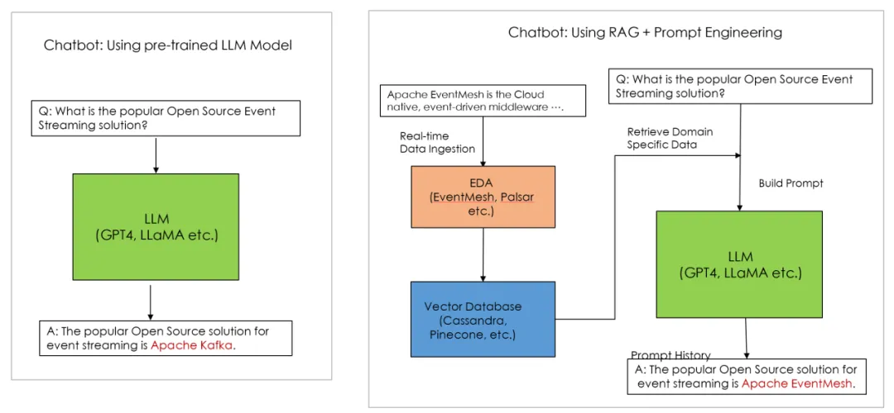

# Event-Driven Architecture in Generative AI

*   Application scenario name

&emsp;&emsp;**Application of Event-Driven Architecture in Generative AI**

*   Application scenario description

&emsp;&emsp;The basic principle of Generative AI is to utilize Deep Learning to learn from large amounts of multimodal data such as text, images, audio, and video, thereby constructing complex statistical models that describe natural language and other data.The training data for these models almost covers all information on the internet, with an immense number of parameters, among which Large Language Models (LLMs) are the most representative. The coherent sentences generated by such models do not stem from an actual "understanding" of the language, but are instead produced by complex mathematical calculations that infer the most likely words or sentence structures, resulting in naturally fluent text output. This process relies on the model’s learning from vast amounts of data, combined with probability theory and optimization algorithms to make predictions and generate results.

&emsp;&emsp;Generative AI, which relies on large language models (LLMs), requires continuous updates to its training data to ensure that the content it generates reflects the latest language usage and information. However, open-source LLMs typically face limitations in domain-specific data. This type of data often belongs to specific industries or remains internal to enterprises, not being publicly available on the internet. As a result, the model cannot access or learn from this information, leading to limitations when addressing problems in specialized fields.

*   Application scenario implementation proposal

&emsp;&emsp;To address this issue, AI experts employ a combination of Retrieval Augmented Generation (RAG) and Prompt Engineering. By inputting domain-specific data into the LLM in real time, the model can leverage the latest information to generate responses. The event-driven mechanism of `EventMesh` is highly compatible with RAG, enabling real-time synchronization of data into the LLM’s vector database. This allows the LLM to generate more accurate responses based on new knowledge, thus facilitating the development of real-time generative AI.

&emsp;&emsp;In addition, `EventMesh's` Event Source and Event Sink can support various types of event sources and event targets, adapting to different kinds of data sources. Whether it's internal enterprise data or external public data, they can be synchronized to the LLM's vector database through the event-driven system, enabling data diversification for the LLM.

&emsp;&emsp;The event-driven architecture also enhances the resilience and scalability of generative AI applications. The Retrieval Augmented Generation (RAG) + Prompt Engineering method requires to establish a data pipeline consisting of multiple microservices to process domain-specific data. The main components of the data pipeline include Tokenization, Data Chunking, Data Vectorization, Word Embedding, and Prompt Builder. The interaction between these microservices can be done asynchronously through an event-driven approach. As the data volume increases, each microservice can independently scale without affecting the overall data pipeline architecture. If AI scientists want to add new microservices, such as a User Feedback App to process user feedback data, it can interact with other microservices in the data pipeline by consuming and publishing specific topics without needing to modify the interfaces of other microservices. `EventMesh's` Serverless Workflow event stream features can be used to build such data pipelines.

&emsp;&emsp;The `EventMesh` community, along with other Apache open-source communities, will continue to explore new application scenarios in the field of generative AI. The Workflow and Event Source/Sink features of the EventMesh architecture can help build generative AI applications, improving the real-time capability and accuracy of AI applications while enhancing their scalability. This enables the creation of real-time, cloud-native generative AI applications.

*   Reference

&emsp;&emsp;[A Speech in Community Over Code NA 2023:"Apache EventMesh in Huawei Cloud Next Generation of Enterprise Cloud Native Event Centre: EventGrid"](https://communityovercode.org/past-sessions/community-over-code-na-2023/)

&emsp;&emsp;[A Technical Blog of EventMesh](https://mp.weixin.qq.com/s/r6tsKEtaSwdwBizty6X6jg)