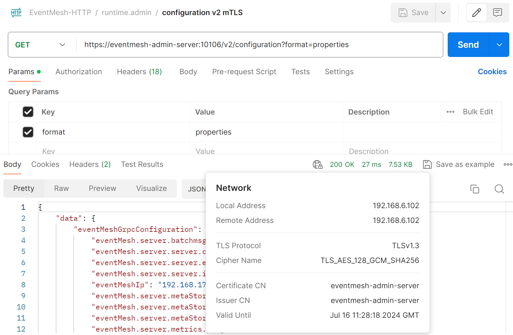
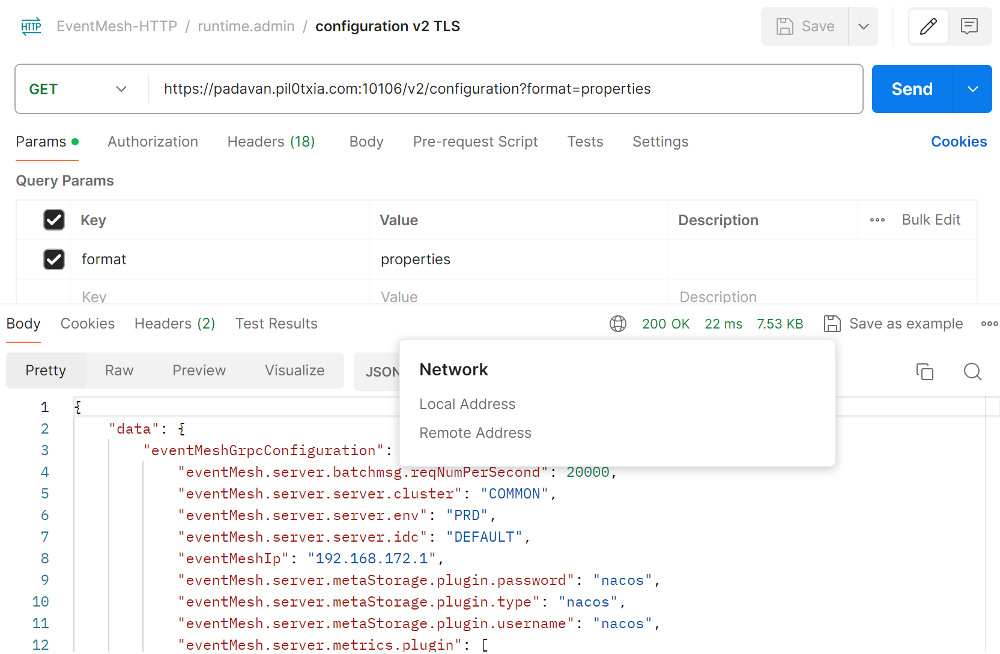

# HTTPS/(m)TLSv1.3

## Enable HTTPS in HTTP Admin Server

### Create a Self-Signed Certificate (mTLS)

EventMesh Runtime currently supports loading SSL certificate files in `jks` format. You can generate a `jks` certificate locally.

```shell
keytool -genkey -alias eventmesh-admin-server -keyalg RSA -keystore eventmesh-admin-server.jks
```

The value of the `-alias` parameter is the hostname or domain name of your EventMesh Runtime node. You can set up a mapping relationship between the hostname/domain name and the IP address on the router/gateway/DNS server.

Most web clients do not accept traffic from servers with self-signed certificates by default. If you trust this self-signed certificate and its network environment, you can allow the client to receive traffic from this self-signed certificate server.

If you do not trust one-way authentication, you can also use two-way TLS (mTLS) to achieve zero-trust security. You need to configure the public key part of this SSL certificate on the client side, such as a `pem` file. The `jks` certificate can be converted to a `pem` file using the `keytool` command.

After the configuration is complete, the effect is as follows:



### Import Authority Certificate (TLS)

You can convert the `nginx`/`apache` format `pem`/`crt`/`key` certificate issued by the authority into `jks` format and deploy it on the EventMesh Runtime server.

This method can support more web clients, such as browsers, because no configuration is required on the web client side.

After the configuration is complete, the effect is as follows:



### Configuration on the eventmesh-runtime side

Configure the following items in `eventmesh.properties`:

```properties
eventMesh.server.admin.useTls.enabled=true # default value false
eventMesh.server.admin.ssl.protocol=TLSv1.3 # default value TLSv1.3, minimum support TLSv1.1
eventMesh.server.admin.ssl.cer=eventmesh-admin-server.jks # place the file in the confPath directory specified in the start.sh startup script, by default in the same directory as eventmesh.properties
eventMesh.server.admin.ssl.pass=eventmesh-admin-server
```

## Enable TLS in SDK

### Configuration on the eventmesh-runtime side

Configure the following items in `eventmesh.properties`:

```properties
eventMesh.server.useTls.enabled=true # default value false
eventMesh.server.ssl.protocol=TLSv1.1 # default value TLSv1.1, maximum support TLSv1.3
eventMesh.server.ssl.cer=sChat2.jks # place the file in the confPath directory specified in the start.sh startup script, by default in the same directory as eventmesh.properties
eventMesh.server.ssl.pass=sNetty
```

You can also configure the certificate and key through environment variables:

```properties
-Dssl.server.protocol=TLSv1.1
-Dssl.server.cer=sChat2.jks
-Dssl.server.pass=sNetty
```

### Configuration on the eventmesh-sdk-java side

```java
// Create producer
LiteClientConfig eventMeshHttpClientConfig = new eventMeshHttpClientConfig();
```

```java
// Set to enable TLS
eventMeshHttpClientConfig.setUseTls(true);
LiteProducer producer = new LiteProducer(eventMeshHttpClientConfig);
```

Configure environment variables:

```properties
-Dssl.client.protocol=TLSv1.1
-Dssl.client.cer=sChat2.jks
-Dssl.client.pass=sNetty
```