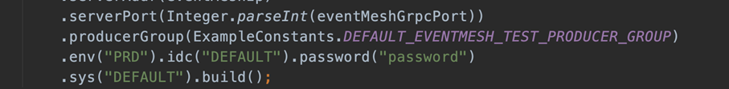
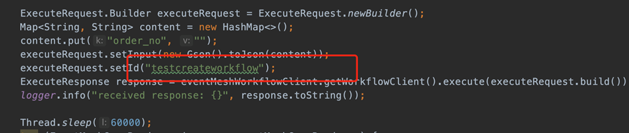
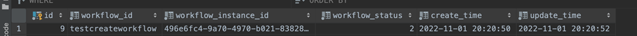
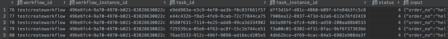

# Run Serverless Workflow Demo

## 1. Environment Requirements

The current Runbook is based on the all-in-one approach, and this document is also based on that premise.

1. MySQL 8.0+

2. Nacos latest version is sufficient

3. EventMesh-Server 

Note: Change connector-type to standalone

All three services mentioned above need to be started in advance.

## 2. Initialize Database

### Initialize workflow database

   ```shell
   cd eventmesh-workflow-go/distribution
   mysql -h mysql_host -u mysql_user -p mysql_password < ./mysql-schema.sql
   ```

### Initialize catalog database

   ```shell
   cd eventmesh-catalog-go/distribution
   mysql -h mysql_host -u mysql_user -p mysql_password < ./mysql-schema.sql
   ```

## 3. Import Workflow Demo Data

### Import eventmesh-workflow db data

- Workflow basic information: t_workflow
- Workflow task information: t_workflow_task
- Workflow task execution information: t_worklfow_task_action
- Workflow task relation information: t_wofkflow_task_relation

```shell
cd eventmesh-workflow-go/cmd
bash build.sh
./workflow-cli create --file ../configs/testcreateworkflow.yaml --dsn "root:123456@(127.0.0.1:3306)/db_workflow?charset=utf8&parseTime=True&loc=Local"
```

### Import eventmesh-catalog db data

```shell
cd eventmesh-catalog-go/cmd
bash build.sh
./catalog-cli create --file ../configs/testorder.yaml --dsn "root:123456@(127.0.0.1:3306)/db_catalog?charset=utf8&parseTime=True&loc=Local"
./catalog-cli create --file ../configs/testpayment.yaml --dsn "root:123456@(127.0.0.1:3306)/db_catalog?charset=utf8&parseTime=True&loc=Local"
./catalog-cli create --file ../configs/testexpress.yaml --dsn "root:123456@(127.0.0.1:3306)/db_catalog?charset=utf8&parseTime=True&loc=Local"
```

## 4. Run Workflow Services

### Run eventmesh-workflow service

Modify the service's runtime configuration file `./configs/workflow.yaml`

```yml
server:
  port: 11012
  name: "EVENTMESH-workflow"
flow:
  queue:
    store: in-memory
  scheduler:
    type: in-line
    interval: 10 # milliseconds
  protocol: meshmessage
catalog:
  server_name: "EVENTMESH-catalog"
eventmesh:
  host: "127.0.0.1"
  env: "PRD"
  idc: "DEFAULT"
  sys: "DEFAULT"
  username: "username"
  password: "password"
  producer_group: "EventMeshTest-producerGroup"
  ttl: 4000
  grpc:
    port: 10205
plugins:
  registry:
    nacos:
      address_list: "127.0.0.1:8848"
  selector:
    nacos:
      address_list: "127.0.0.1:8848"
  database:
    mysql:
      dsn: "root:123456@(127.0.0.1:3306)/db_workflow?charset=utf8&parseTime=True&loc=Local"
      max_idle: 50
      max_open: 100
      max_lifetime: 180000
  log:
    default:
      - writer: file
        level: info
        writer_config:
          filename: ./workflow.log
          max_size: 10
          max_backups: 10
          max_age: 7
          compress:  false
    schedule:
      - writer: file
        level: info
        writer_config:
          filename: ./workflow_schedule.log
          max_size: 10
          max_backups: 10
          max_age: 7
          compress:  false
    queue:
      - writer: file
        level: info
        writer_config:
          filename: ./workflow_queue.log
          max_size: 10
          max_backups: 10
          max_age: 7
          compress:  false
```

Run the service: (Can also be directly run in GoLand using main)

```shell
go build
./eventmesh-workflow-go
```

Notes:

 - Eventmesh configuration needs to correspond to eventmsh-server configuration.

   ```yml
   eventmesh:
     host: "127.0.0.1"
     env: "PRD"
     idc: "DEFAULT"
     sys: "DEFAULT"
     username: "username"
     password: "password"
     producer_group: "EventMeshTest-producerGroup"
     ttl: 4000
     grpc:
       port: 10205
   ```

 - Nacos address needs to be modified.

 - MySQL DSN needs to be modified.

### Run eventmesh-catalog service

Modify the configuration file `./configs/catalog.yaml`, similar points to the workflow service.

Run the service: (Can also be directly run in GoLand using main)

```shell
go build
./eventmesh-catalog-go
```

## 5. Run Workflow Demo Pub/Sub Application

It is necessary to start the pub/sub application after the successful run of eventmesh-workflow/eventmesh-catalog services.

### Pub application

WorkflowAsyncPublishInstance

1. This configuration needs to correspond to EventMesh-Server.



2. Workflowid needs to correspond to the imported data.



### Sub application

WorkflowOrderAsyncSubscribe

WorkflowPaymentAsyncSubscribe

WorkflowExpressAsyncSubscribe

Note: workflowid needs to correspond to the imported data.

Run results:

- t_workflow_instance: Status 2, run completed.



- t_workflow_task_instance: All tasks in the process have status 4, run successful.

