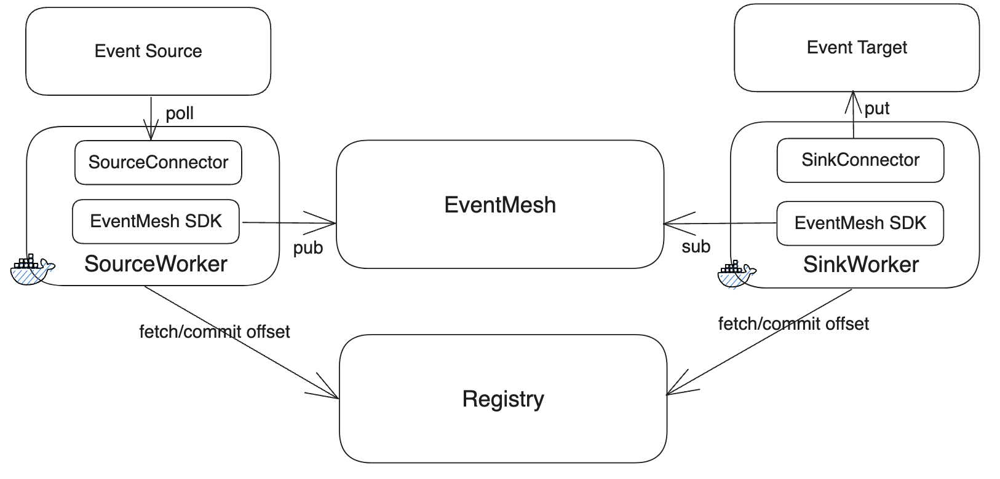
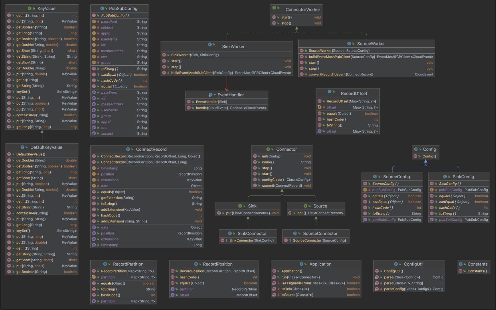

# 连接器简介

## 连接器类型

连接器是代表用户应用程序与特定外部服务或底层数据源（例如数据库）交互的镜像或实例。连接器的类型可以是源（Source）或汇（Sink）。

## 数据源（Source 端）

源连接器从底层数据生产者获取数据，并在原始数据被转换为 CloudEvents 后将其传递给目标。源连接器不限制源如何检索数据（例如，源可以从消息队列中获取数据，也可以充当等待接收数据的 HTTP 服务器）。

## 数据汇（Sink 端）

汇连接器接收 CloudEvents 并执行特定的业务逻辑（例如，MySQL 的汇连接器从 CloudEvents 中提取有用的数据，并将其写入 MySQL 数据库）。

## CloudEvents

CloudEvents 是一种以通用格式描述事件数据的规范，以提供服务、平台和系统之间的互操作性。

## 实现连接器

使用 [eventmesh-openconnect-java](https://github.com/apache/eventmesh/tree/master/eventmesh-openconnect/eventmesh-openconnect-java) 实现 Source/Sink 接口即可添加新的连接器。

## 技术方案

### 结构与处理流程

### 详细设计

### 描述

#### Worker

Worker 分为 Source Worker 与 Sink Worker，由`Application`类进行触发运行，分别实现了`ConnectorWorker`接口的方法，其中包含了 worker 的运行生命周期，worker 承载了 connector 的运行。Worker 可以通过镜像的方式轻量的独立运行，内部集成了 eventmesh-sdk-java 模块，采用 CloudEvents 协议与 EventMesh 进行交互，目前默认采用 TCP 客户端，后续可以考虑支持动态可配。

#### Connector

Connector 分为 Source Connector 与 Sink Connector，connector 有各自的配置文件，以及独立运行的方式，通过 worker 进行反射加载与配置解析，完成 Connector 的初始化以及后续运行工作，其中 Source Connector 实现 poll 方法，Sink Connector 实现 put 方法，统一使用`ConnectorRecord`承载数据。Source Connector 与 Sink Connector 均可独立运行。

#### ConnectorRecord with CloudEvents

`ConnectorRecord`为 connector 层数据协议，当 worker 与 EventMesh 进行交互时需开发协议适配器进行`ConnectorRecord`到 CloudEvents 的协议转换。

#### Registry

`Registry`模块负责存储同步不同 Connector 实例的数据的同步进度，确保多个 Connector 镜像或实例之间的高可用。

## 连接器实现状态

|                  连接器名称                  | 源 |   汇   |
|:------------------------------------------:|:------:|:------:|
|     [RocketMQ](https://github.com/apache/eventmesh/tree/master/eventmesh-connectors/eventmesh-connector-rocketmq)     |    ✅    |    ✅    |
|                     ChatGPT                      |    ⬜    |    ⬜    |
|                    ClickHouse                    |    ⬜    |    ⬜    |
|     [钉钉](https://github.com/apache/eventmesh/tree/master/eventmesh-connectors/eventmesh-connector-dingtalk)     |    ⬜    |    ✅    |
|                      邮件                       |    ⬜    |    ⬜    |
|     [飞书/Lark](./lark-connector)      |    ⬜    |    ✅    |
|         [文件](https://github.com/apache/eventmesh/tree/master/eventmesh-connectors/eventmesh-connector-file)         |    ✅    |    ✅    |
|                      GitHub                      |    ⬜    |    ⬜    |
|         [HTTP](https://github.com/apache/eventmesh/tree/master/eventmesh-connectors/eventmesh-connector-http)         |    ✅    |    ⬜    |
|         [Jdbc](https://github.com/apache/eventmesh/tree/master/eventmesh-connectors/eventmesh-connector-jdbc)         |    ⬜    |    ✅    |
|        [Kafka](https://github.com/apache/eventmesh/tree/master/eventmesh-connectors/eventmesh-connector-kafka)        |    ✅    |    ✅    |
|      [Knative](./knative-connector)      |    ✅    |    ✅    |
|      [MongoDB](https://github.com/apache/eventmesh/tree/master/eventmesh-connectors/eventmesh-connector-mongodb)      |    ✅    |    ✅    |
| [OpenFunction](https://github.com/apache/eventmesh/tree/master/eventmesh-connectors/eventmesh-connector-openfunction) |    ✅    |    ✅    |
|      [Pravega](https://github.com/apache/eventmesh/tree/master/eventmesh-connectors/eventmesh-connector-pravega)      |    ✅    |    ✅    |
|   [Prometheus](https://github.com/apache/eventmesh/tree/master/eventmesh-connectors/eventmesh-connector-prometheus)   |    ✅    |    ⬜    |
|       [Pulsar](https://github.com/apache/eventmesh/tree/master/eventmesh-connectors/eventmesh-connector-pulsar)       |    ✅    |    ✅    |
|     [RabbitMQ](https://github.com/apache/eventmesh/tree/master/eventmesh-connectors/eventmesh-connector-rabbitmq)     |    ✅    |    ✅    |
|        [Redis](https://github.com/apache/eventmesh/tree/master/eventmesh-connectors/eventmesh-connector-redis)        |    ✅    |    ✅    |
|        [S3 存储](https://github.com/apache/eventmesh/tree/master/eventmesh-connectors/eventmesh-connector-s3)        |    ⬜    |    ✅    |
|        [Slack](https://github.com/apache/eventmesh/tree/master/eventmesh-connectors/eventmesh-connector-slack)        |    ⬜    |    ✅    |
|       [Spring](https://github.com/apache/eventmesh/tree/master/eventmesh-connectors/eventmesh-connector-spring)       |    ✅    |    ✅    |
|        [企业微信](https://github.com/apache/eventmesh/tree/master/eventmesh-connectors/eventmesh-connector-wecom)        |    ⬜    |    ✅    |
|       [微信](https://github.com/apache/eventmesh/tree/master/eventmesh-connectors/eventmesh-connector-wechat)       |    ⬜    |    ✅    |
|         更多连接器正在计划中 ...         |   N/A   |   N/A   |
