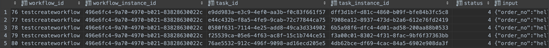

# 运行 Serverless Workflow Demo

## 1. 环境要求

当前 Runbook 基于单机 (all-in-one) 方式，本文档也是基于该前提。

1. MySQL 8.0+
2. Nacos 最新版本即可
3. EventMesh-Server 

注意：connector-type 需要修改为 standalone

以上三个服务需要提前运行起来。

## 2. 初始化数据库

### 初始化 workflow 数据库

```shell
cd eventmesh-workflow-go/distribution
mysql -h mysql_host -u mysql_user -p mysql_password < ./mysql-schema.sql
```

### 初始化 catalog 数据库

```shell
cd eventmesh-catalog-go/distribution
mysql -h mysql_host -u mysql_user -p mysql_password < ./mysql-schema.sql
```

## 3. 导入工作流演示数据

### 导入 eventmesh-workflow 数据库数据

- 工作流基础信息：t_workflow
- 工作流任务信息：t_workflow_task
- 工作流任务执行信息：t_worklfow_task_action
- 工作流任务关系信息：t_wofkflow_task_relation

```shell
cd eventmesh-workflow-go/cmd
bash build.sh
./workflow-cli create --file ../configs/testcreateworkflow.yaml --dsn "root:123456@(127.0.0.1:3306)/db_workflow?charset=utf8&parseTime=True&loc=Local"
```

### 导入 eventmesh-catalog 数据库数据

```shell
cd eventmesh-catalog-go/cmd
bash build.sh
./catalog-cli create --file ../configs/testorder.yaml --dsn "root:123456@(127.0.0.1:3306)/db_catalog?charset=utf8&parseTime=True&loc=Local"
./catalog-cli create --file ../configs/testpayment.yaml --dsn "root:123456@(127.0.0.1:3306)/db_catalog?charset=utf8&parseTime=True&loc=Local"
./catalog-cli create --file ../configs/testexpress.yaml --dsn "root:123456@(127.0.0.1:3306)/db_catalog?charset=utf8&parseTime=True&loc=Local"
```

## 4. 运行工作流服务

### 运行 eventmesh-workflow 服务

修改服务运行配置文件 `./configs/workflow.yaml`

```yml
server:
port: 11012
name: "EVENTMESH-workflow"
flow:
queue:
  store: in-memory
scheduler:
  type: in-line
  interval: 10 # milliseconds
protocol: meshmessage
catalog:
server_name: "EVENTMESH-catalog"
eventmesh:
host: "127.0.0.1"
env: "PRD"
idc: "DEFAULT"
sys: "DEFAULT"
username: "username"
password: "password"
producer_group: "EventMeshTest-producerGroup"
ttl: 4000
grpc:
  port: 10205
plugins:
registry:
  nacos:
    address_list: "127.0.0.1:8848"
selector:
  nacos:
    address_list: "127.0.0.1:8848"
database:
  mysql:
    dsn: "root:123456@(127.0.0.1:3306)/db_workflow?charset=utf8&parseTime=True&loc=Local"
    max_idle: 50
    max_open: 100
    max_lifetime: 180000
log:
  default:
    - writer: file
      level: info
      writer_config:
        filename: ./workflow.log
        max_size: 10
        max_backups: 10
        max_age: 7
        compress:  false
  schedule:
    - writer: file
      level: info
      writer_config:
        filename: ./workflow_schedule.log
        max_size: 10
        max_backups: 10
        max_age: 7
        compress:  false
  queue:
    - writer: file
      level: info
      writer_config:
        filename: ./workflow_queue.log
        max_size: 10
        max_backups: 10
        max_age: 7
        compress:  false
```

运行服务： （也可以直接在 GoLand 直接运行 main）

```shell
go build
./eventmesh-workflow-go
```

注意：
- Eventmesh 配置需要和 eventmsh-server 的配置一一对应。

 ```yml
 eventmesh:
   host: "127.0.0.1"
   env: "PRD"
   idc: "DEFAULT"
   sys: "DEFAULT"
   username: "username"
   password: "password"
   producer_group: "EventMeshTest-producerGroup"
   ttl: 4000
   grpc:
     port: 10205
 ```

- Nacos 地址需要修改。

- MySQL DSN 需要修改。

### 运行 eventmesh-catalog 服务

修改配置文件 `./configs/catalog.yaml`，相关注意点同 workflow 服务。

运行服务： （也可以直接在 GoLand 直接运行 main）

```shell
go build
./eventmesh-catalog-go
```

## 5. 运行工作流演示 Pub/Sub 应用

需要在 eventmesh-workflow/eventmesh-catalog 服务运行成功后再启动 pub/sub 应用。

### Pub 应用

WorkflowAsyncPublishInstance

1. 这个配置需要和 EventMesh-Server 一一对应。


1. Workflowid 需要和导入的数据一一对应上。


### Sub 应用

WorkflowOrderAsyncSubscribe

WorkflowPaymentAsyncSubscribe

WorkflowExpressAsyncSubscribe

注意：workflowid 需要和导入的数据一一对应上。

运行结果：
- t_workflow_instance: 状态为 2，运行结束。


- t_workflow_task_instance: 流程所有任务状态为 4，运行成功。

