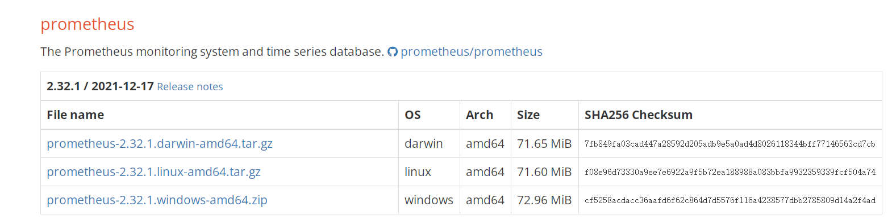
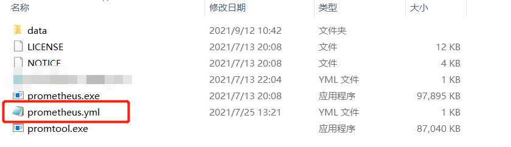
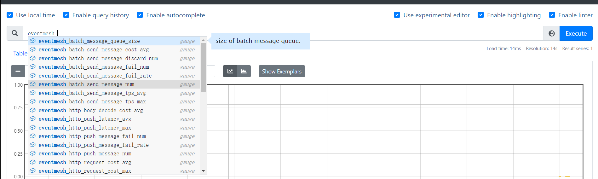

# 通过 Prometheus 观察 Metrics

## 下载 Prometheus

官网：https://prometheus.io/

本地下载 Prometheus：https://prometheus.io/download/

选择自己电脑对应的版本下载并解压缩



### 2、在 prometheus.yml 中添加配置

如果你是 Prometheus 的新手，可以直接复制 eventmesh-runtime/conf/prometheus.yml 替换

例如：这是 win-64 的下载后的样子：



替换红框中的文件

如果你十分了解 Prometheus，可以自行配置，eventmesh 默认的导出的端口为 19090。

ps：如果需要更换端口的话，请修改 eventmesh-runtime/conf/eventmesh.properties 中的

```properties
#prometheusPort
eventMesh.metrics.prometheus.port=19090
```

## 运行 Prometheus 和 EventMesh

双击 Prometheus.exe 运行

运行 eventmesh-starter(参考[eventmesh-runtime-quickstart](../instruction/02-runtime.md))

运行 eventmesh-example(参考[eventmesh-sdk-java-quickstart](../instruction/03-demo.md))

打开浏览器访问：http://localhost:9090/

### 输入想观察的 Metrics

输入’**eventmesh_**‘就会出现相关的指标的提示


